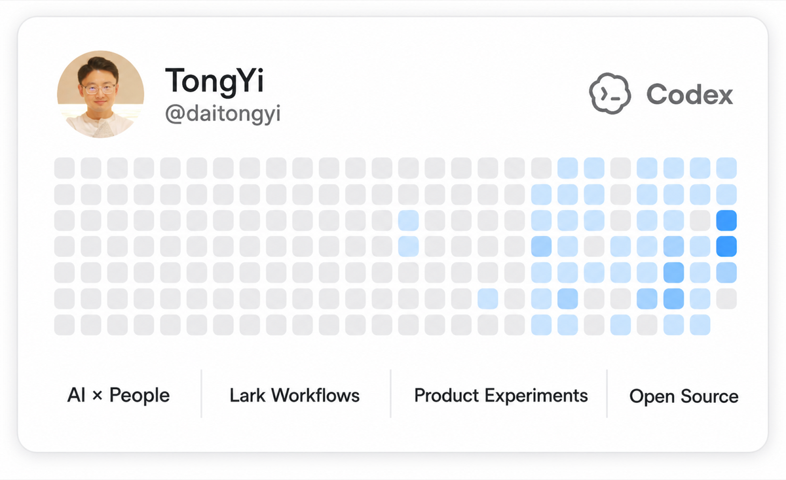

# Hi, I'm Tongyi 👋

AI × People × Workflow

Building useful systems for hiring, performance, collaboration, and everyday work.

  

## Selected work

- [Geometry Board](https://github.com/TongyiDai/geometry-board-skill) — restrained visual systems for Feishu docs
- [Career Ops](https://github.com/TongyiDai/career-ops-zh) — an AI career operating system for the Chinese job market
- [Time is Money](https://github.com/TongyiDai/timeismoney) — a tiny calculator for the value of working time

> Make complex work easier to see, decide, and ship.
