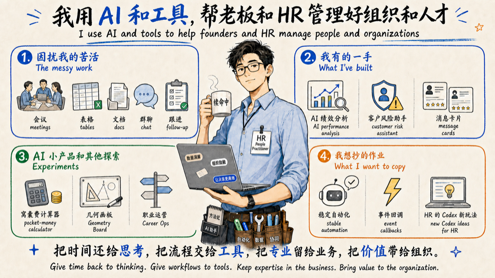

> 我用 AI 和工具，帮老板和 HR 管理好组织和人才。  
> I use AI and tools to help founders and HR manage people and organizations.

# 戴同一｜Tongyi Dai 👋

  

## 精选项目｜Featured Projects

  
  
   
  
  
  

## 全部项目｜All Projects

  
<strong>展开全部项目（11）</strong>

  
  
   
  
  
   
  
  
   
  
  

## 联系｜Contact

  
<strong>扫码联系｜Scan to connect</strong>

  
  &emsp;&emsp;&emsp;
  

---

> 把时间还给思考，把流程交给工具，把专业留给业务，把价值带给组织。  
> Give time back to thinking. Give workflows to tools. Keep expertise in the business. Bring value to the organization.
